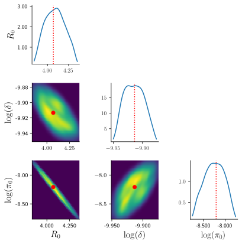
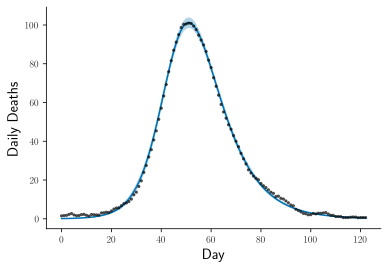
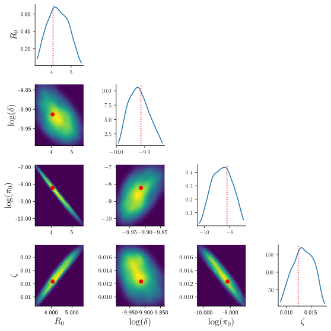
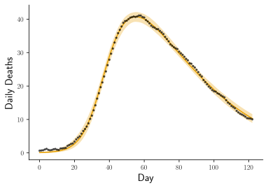

# epi-behavior-models
This repository contains the source code for the paper:

- The Paradox of Neglecting Changes in Behavior: How Standard Epidemic Models Misestimate Both Transmissibility and Final Epidemic Size

- [PDF](https://www.medrxiv.org/content/10.64898/2025.12.07.25341782v3.full.pdf) | [Supplement](https://www.medrxiv.org/content/medrxiv/early/2025/12/29/2025.12.07.25341782/DC1/embed/media-1.pdf?download=true)

## Overview
This repository provides a framework for parameter inference of compartmental epidemic models that incorporate human behavioral feedback. The inference is performed using Approximate Bayesian Computation based on Sequential Monte Carlo (ABC-SMC) using [pyABC](https://pyabc.readthedocs.io/en/latest/) library.

It includes:
- Implementation of SEIRD models with constant and behavioral transmission.
- ABC-SMC pipeline for estimating posterior distributions of epidemiological parameters.
- Bayesian model selection to compare behavioral and baseline model performance (using Bayes factors).
- Analysis and diagnostics of the inference results and visualizations in R.

## Examples
In the examples below we estimate parameters from synthetic observations for two models.

### 1. Baseline model (SEIRD)
Recovery of parameters under the assumption of constant transmission $\beta(t) = \beta_0$:
```bash
python3 src/run_example.py --model baseline
```
| Estimated posterior (KDE) | Model fit to synthetic data |
| :---: | :---: |
|  |  |

The red dashed lines and markers indicate the ground-truth parameters used to generate the synthetic observations.

### 2. Behavioral model (Mixed form)
Recovery of parameters when including the behavioral sensitivity $\zeta$:
```bash
python3 src/run_example.py --model behavior
```
| Estimated posterior (KDE) | Model fit to synthetic data |
| :---: | :---: |
|  |  |

The red dashed lines and markers indicate the ground-truth parameters used to generate the synthetic observations.

## Reproducing results
### 1. Installation
Clone the repository
```bash
git clone https://github.com/markolalovic/epi-behavior-models.git
cd epi-behavior-models
```

Install the minimal set of Python packages in a fresh virtual environment:
```bash
python3 -m venv .venv
source .venv/bin/activate
python3 -m pip install --upgrade pip
python3 -m pip install -r requirements.txt
```

### 2. Data
The models are calibrated to COVID-19 mortality data from the Johns Hopkins University (JHU) CSSE repository:

- Source: [CSSEGISandData](https://github.com/CSSEGISandData/COVID-19/tree/master/csse_covid_19_data/csse_covid_19_time_series)
- Direct link: [`time_series_covid19_deaths_US.csv`](https://github.com/CSSEGISandData/COVID-19/blob/4360e50239b4eb6b22f3a1759323748f36752177/csse_covid_19_data/csse_covid_19_time_series/time_series_covid19_deaths_US.csv)
- File size: 11.9 MB

Note: `time_series_covid19_deaths_US.csv` is large and not tracked by version control, see `.gitignore`.

Download the CSV file and place it in `data/raw/` before execution.

### 3. Execution
To regenerate all results: processed data, summary statistics, figures and tables, run:
```bash
./run_all.sh --all
```

Note: full inference across 30 locations is computationally intensive.

See [`run_all.sh`](./run_all.sh) how to set flags to skip some parts, or use the provided summary statistics to regenerate tables and figures.

Note: Regenerating the figures and tables requires R (Version $\ge 4$) and the following R packages:
```R
install.packages(c(
    "ggplot2", "dplyr", "tidyr", "reticulate", "tikzDevice",
    "patchwork", "knitr", "kableExtra", "ggh4x"))
```

## Citation
```bibtex
@article {Pant2025Behavior,
  author = {Pant, Binod and Lalovic, Marko and Kiss, Istv{\'a}n Z. and Santillana, Mauricio},
  title = {The Paradox of Neglecting Changes in Behavior: How Standard Epidemic Models Misestimate Both Transmissibility and Final Epidemic Size},
  year = {2025},
  doi = {10.64898/2025.12.07.25341782},
  journal = {medRxiv},
  note = {Preprint. Submitted to PLOS Computational Biology},
  url = {https://www.medrxiv.org/content/10.64898/2025.12.07.25341782v3},
}
```
